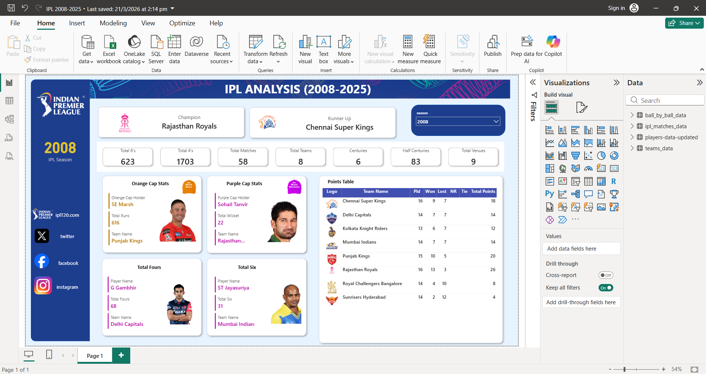

# 🏏 IPL Analytics Dashboard (2008–2025) — Power BI Project


> An interactive Power BI analytics dashboard covering **17 seasons** of the Indian Premier League (IPL), from the inaugural 2008 season to 2025. Explore team performance, player stats, match outcomes, toss trends, and much more — all in one place.

---

## 📸 Dashboard Preview

### 🏆 Season 2008 — Rajasthan Royals Champions


---

### 📅 Season Selector — Year Dropdown in Action (2010 shown)


---

### 🥇 Season 2025 — Royal Challengers Bangalore Champions


---

## 📁 Project Structure

```
power_bi_project/
│
├── IPL_2008-2025.pbit           # Power BI Template file (main report)
├── ipl_matches_data.csv         # Match-level data: results, venues, toss info
├── players-data-updated.csv     # Player profiles: batting/bowling styles, images
├── teams_data.csv               # Team metadata: names, short codes, logos
├── screenshots/                 # Dashboard preview images
│   ├── Screenshot_2026-03-27_220746.png
│   ├── Screenshot_2026-03-27_220901.png
│   └── Screenshot_2026-03-27_220930.png
└── README.md                    # Project documentation (this file)
```

---

## 📊 Dataset Overview

### 1. `ipl_matches_data.csv` — Match Data
- **Rows:** ~1,169 matches | **Seasons:** 2008–2025
- **Key Columns:**

| Column | Description |
|---|---|
| `match_id` | Unique match identifier |
| `season` | IPL season year |
| `city` / `venue` | Match location |
| `match_date` | Date of the match |
| `team1`, `team2` | Competing teams |
| `toss_winner` | Team that won the toss |
| `toss_decision` | Bat or Field |
| `match_winner` | Winning team |
| `win_by_runs` | Margin of victory (runs) |
| `win_by_wickets` | Margin of victory (wickets) |
| `player_of_match` | Man of the Match award |
| `stage` | League / Qualifier / Final |
| `result` | Match result type |

---

### 2. `players-data-updated.csv` — Player Data
- **Rows:** ~772 players
- **Key Columns:**

| Column | Description |
|---|---|
| `player_id` | Unique player ID |
| `player_name` | Short name |
| `player_full_name` | Full official name |
| `bat_style` | Batting hand (Right/Left) |
| `bowl_style` | Bowling type (e.g., Legbreak, Medium fast) |
| `field_pos` | Fielding position |
| `player_image` | ESPNcricinfo profile URL |

---

### 3. `teams_data.csv` — Teams Data
- **Rows:** 16 teams (active + historical)
- **Key Columns:**

| Column | Description |
|---|---|
| `team_id` | Unique team identifier |
| `team_name` | Full team name |
| `team_name_short` | Abbreviation (e.g., MI, CSK, RCB) |
| `image_url` | Official team logo URL |

**Teams included:** RCB, SRH, MI, KKR, CSK, RR, DC, PBKS, LSG, GT, Deccan Chargers, Kochi Tuskers, Pune Warriors, Gujarat Lions, Rising Pune Supergiant, and more.

---

## 📈 Dashboard Features

The `.pbit` Power BI Template includes the following report pages/visuals:

- 🏆 **Season Overview** — Winner by year, total matches, top performers
- ⚔️ **Head-to-Head** — Team vs team win/loss records
- 🪙 **Toss Analysis** — Toss win vs match win correlation, bat/field decisions
- 🏟️ **Venue Insights** — Matches by city, home advantage stats
- 🎯 **Player Performance** — Man of the Match leaders, batting/bowling styles
- 📅 **Year-wise Trends** — Season-by-season comparison
- 🥇 **Team Performance** — Win percentages, titles won

---

## 🚀 Getting Started

### Prerequisites
- [Microsoft Power BI Desktop](https://powerbi.microsoft.com/desktop/) (free download)

### Steps to Open the Report

1. **Clone this repository:**
   ```bash
   git clone https://github.com/ommakhana/PowerBI-IPL-Analytics.git
   cd PowerBI-IPL-Analytics
   ```

2. **Open Power BI Desktop**

3. **Open the template file:**
   - Go to `File → Open report`
   - Select `IPL_2008-2025.pbit`

4. **Connect the data sources** (if prompted):
   - Point to the CSV files in the same project folder
   - Files: `ipl_matches_data.csv`, `players-data-updated.csv`, `teams_data.csv`

5. **Refresh the data** and explore the dashboard!

---

## 🔧 Data Sources

| File | Source |
|---|---|
| Match Data | [IPL Official Stats / ESPNcricinfo](https://www.espncricinfo.com/) |
| Player Data | [ESPNcricinfo](https://www.espncricinfo.com/) |
| Team Logos | [IPL Official CDN](https://documents.iplt20.com/) |

---

## 🧠 Key Insights You Can Explore

- Which team has the best win rate in the history of IPL?
- Does winning the toss actually help win the match?
- Which venues favor chasing teams?
- Who are the most consistent Man of the Match winners?
- How has team dominance shifted across seasons?

---

## 👤 Author

**Om Makhana**
- GitHub: [@ommakhana](https://github.com/ommakhana)

---

## 📄 License

This project is open source and available under the [MIT License](LICENSE).

---

> ⭐ If you found this project useful, please give it a star on GitHub!
